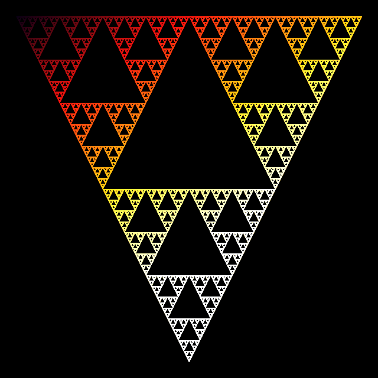
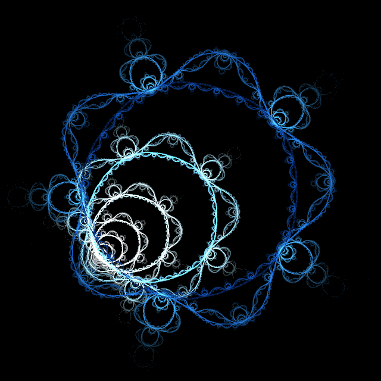

# Apophysis 7X — Browser Port

A browser-only port of [Apophysis 7X](https://sourceforge.net/projects/apophysis7x/),
the fractal flame editor, from Delphi to Rust/WebAssembly + React.

**Live: https://johnb8005.github.io/apophysis-7x/**

No backend, no install — the renderer runs entirely in your browser as WebAssembly.

| | |
|---|---|
|  |  |
| Three half-scale linear transforms — the correctness check: this shape is unmistakable, so a fault anywhere in the chaos game, the xaos tables, the camera or the tone curve shows up immediately. | `spherical` + `swirl`, the classic flame look. |
|  |  |
| `julian` at power 5 with `pre_spherical` and `curl`. The five-fold symmetry is what makes a wrong dispatch kernel obvious at a glance. | `bwraps` cell-warp with `spherical`. |

All four are rendered by the ported engine and regenerated with
`cargo run --example gallery --release -- docs/images`, so they double as a
visual regression check.

---

## Credits

This is a derivative work. The fractal flame algorithm and the original
implementation are the work of others, and the port exists only because they
published theirs.

| | |
|---|---|
| **Scott Draves** | Invented the fractal flame algorithm and wrote [flam3](https://flam3.com), the ancestor of this entire codebase. See [*The Fractal Flame Algorithm*](https://flam3.com/flame_draves.pdf) (Draves & Reckase, 2003). |
| **Ronald Hordijk** | Wrote the screensaver whose rendering engine Apophysis adapted. |
| **Mark Townsend** | Apophysis, 2001–2004 — the original Delphi application. |
| **Ronald Hordijk, Piotr Borys, Peter Sdobnov** | Apophysis, 2005–2006. |
| **Piotr Borys, Peter Sdobnov** | Apophysis, 2007–2008. |
| **Peter Sdobnov** | The Apophysis "3D hack", 2007–2008. |
| **Georg Kiehne** | Apophysis "7X", 2009–2010 — the version this port is based on. |

The Delphi sources are preserved in [`src/`](src/) and remain the reference
implementation. Where the port deviates, it is noted below and in code comments.

## License

**GPL-2.0-or-later**, inherited from the original — see [LICENSE](LICENSE).

Apophysis is copyleft, not permissive. A translation into another language is a
derivative work, so this port carries the same license. If you fork it, yours
must too, and you must make source available to your users.

---

## Architecture

```
src/                    Original Delphi sources (reference)
crates/flame-core/      Rust renderer -> wasm32-unknown-unknown
web/                    React + TypeScript + Tailwind frontend
```

The renderer is Rust compiled to WebAssembly; the UI is React. Rendering runs in
a Web Worker so the interface stays responsive during a render.

### What is ported

- `XForm` / `ControlPoint` data model, with the original's exact transform ordering
- All 29 built-in variations
- The chaos game, including per-transform xaos tables (a first-order Markov chain)
- Camera projection: 2D, pitch, pitch+yaw, and depth of field
- Gaussian reconstruction filter and log-density tone mapping

- All 29 built-in and all 47 plugin variations — 76 in total
- `.flame` load and save, including the `new_linear` compatibility path
- All 701 built-in gradients
- The transform editor: triangle canvas, variations, variables, xaos, colors
- Mouse navigation, undo/redo, PNG export

### Not yet ported

The mutation grid, the curves editor, and the Pascal scripting engine. The
Chaotica and UPR exporters are deliberately dropped — they target external
native renderers that cannot exist in a browser.

---

## Development

Requires [Bun](https://bun.sh), Rust with the `wasm32-unknown-unknown` target,
and [wasm-pack](https://rustwasm.github.io/wasm-pack/).

```bash
cd web
bun install
bun run wasm     # build the Rust renderer to WebAssembly
bun run dev      # http://localhost:5173
```

Render natively, without the browser:

```bash
cd crates/flame-core
cargo test
cargo run --example gallery --release -- ../../docs/images   # the images above
cargo run --example loadtest --release -- input.flame out.png
```

`loadtest` prints how each transform parsed, which is the quickest way to check
whether a real-world file triggered the `new_linear` synthesis path.

Deployment is automatic: pushing to `master` triggers
[`.github/workflows/deploy.yml`](.github/workflows/deploy.yml).

---

## Fidelity notes

A faithful port means reproducing behaviour that looks like a bug but is
load-bearing — output depends on it, and "fixing" it changes every render.
These are all verified against the Delphi source:

- **`arctan2(FTx, FTy)` has its arguments swapped** relative to the conventional
  `atan2(y, x)`. Every polar-family variation depends on it. Pinned by a test.
- **`flatten` has no `post_` prefix but runs in the post pass**, so pass
  assignment cannot be a name-prefix check.
- **The post affine does not touch z.**
- **`for i := 0 to FUSE` is 16 warmup iterations, not 15** — the loop is inclusive.
- **XML `brightness` is stored unscaled.** Only the legacy *text* parser divides by
  `BRIGHT_ADJUST` (`ControlPoint.pas:932` vs `Main.pas:5109`).
- **`.flame` I/O lives in `Main.pas`, not `ParameterIO.pas`.** The latter is
  compiled but has zero call sites, and diverges from the live path.

### Deliberate deviations

- **Blur variations called `Randomize` on every point**, reseeding the global RNG
  from the system clock. The original flags this itself (`// Randomize here =
  HACK! Fix me...`). Replaced with seeded per-worker streams, so renders are
  reproducible.
- **Density estimation is dead code upstream** — `if fcp.enable_de and false then
  InitDE` — and the kernel present is unfinished and self-flagged `// -X- TODO
  fix...`. Not ported; flam3's DE will be used instead.
- **The accumulation buffer is f64 throughout.** The 32-bit Delphi build uses f32,
  which drifts on long renders of bright pixels.

---

## Building the original Delphi version

The Delphi sources still build. See [`build.cmd`](build.cmd); Apophysis 7X was
developed with Delphi XE2 and needs Scripter Studio, a native XML parser, Indy,
and PNG Delphi. [`CHANGES.md`](CHANGES.md) has the original changelog.
